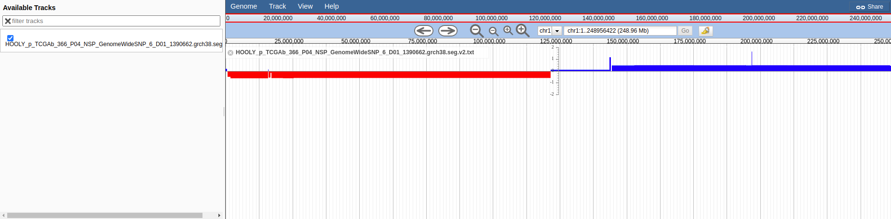

# segmentcnv

A JBrowse plugin for plotting SEG files from GDC API or similar

## Track options

* urlTemplate - a GDC link to a .seg.txt file

## Screenshot

Figure. Wiggle track display of raw seg.txt CNV data from the GDC repository

## Installation

Clone the repository to the jbrowse plugins subdirectory and name it SegmentCNV

    git clone https://github.com/cmdcolin/jbrowse_segmentcnv SegmentCNV

Then add the plugin to your configuration, e.g. "plugins": ["SegmentCNV"]

See http://gmod.org/wiki/JBrowse_FAQ#How_do_I_install_a_plugin for details
